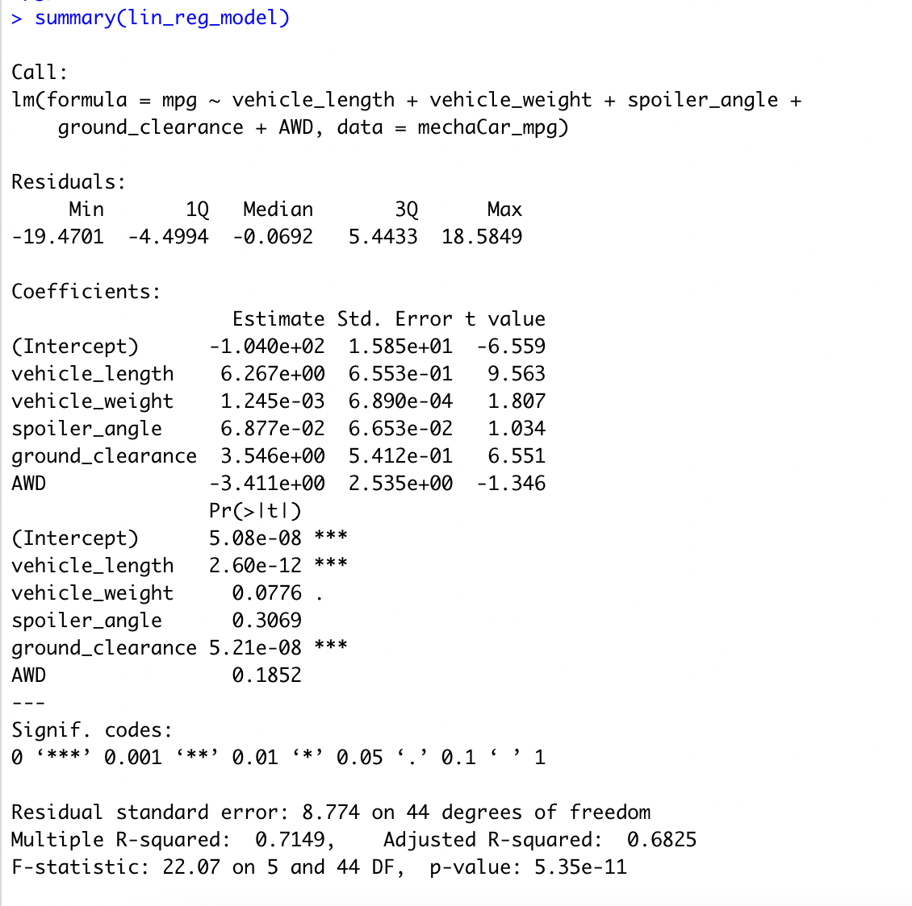

# MechaCar_Statistical_Analysis

## Linear Regression to Predict MPG

A linear regression model helps one understand the data and assists in the providing an explanation of its relationship. In this instance the linear regression model helps predict the MPG of MechaCars future cars by analyzing other cars: length, weight, spoiler angle, ground clearance and AWD. These would be considering the independent variables, as they are NOT reliant on other factors, within the data set. 

•	The variables that provided a non-random amount of variance on MPG was vehicle length and ground clearance. These two variables are significantly smaller than that of the other variables (under Pr(>ltl). These skewed variables have heavily impacted the intercept. 

•	When looking at the results, the slope is not equal to 0, proving the null hypothesis will be rejected. The p-value was smaller than that of the significance value, which is 0.05. 

•	The r-squared, also known as correlation coefficient. This value is important as it will optimistically measure the likelihood of future data fitting in the linear regression mode, meaning as more independent variables are added the value will increase, and its value will be between -1 and +1. In this instance, the r-squared value is 0.7149, meaning that the model is roughly 71% accurate. On the other-hand, the adjusted r-squared, tries to help you optimize your data. When extra variables are added, the value won’t increase unless it sees it as necessary, but rather decrease the value. Our model could benefit from additional variables, when one of the variables was removed both the adjusted r-squared and r squared values went down. With the current r-squared values, the linear regression model effectively predicts the MPG.  With the current adjusted r-squared value being 0.6825, showing its about 68% accurate. Ideally, the r-squared values should be higher to prove its efficiency, its accuracy is acceptable. 

## Summary Statistics on Suspension Coils
Susp coil sum image 

•	The total summary has a variance of 62.3, which is under the 100 pounds per square inch, but the total summary averages all the lots. When looking at the lots individually, it’s clear that lots 1 and 2 have met the standard, but lot 3 has not. Lot 3 surpasses the 100 pound per square inch cut off by 70lb per square inch. 

## T-Tests on Suspension Coils

total lot sum image 

•	When performing a t.test on the suspension coils on the total of manufacturing lots, it’s been determined that they’re not different from the population mean (1500 PSI). The p-value is 0.06028, which is more than the significance value (0.05), thus we are able to conclude that the null hypothesis will not be rejected. 

each lots (1-3) image

•	The t.test of lot 1 for the suspension coils process it’s not different from the population mean. The p-value is 1, which is too high in comparison to the significance value. This proves that the null hypothesis will not be rejected. 

•	The t.test of lot 2 for the suspension coils process it’s not different from the population mean. The p-value is 0.6072, which is more than the significance value. This proves that the null hypothesis will not be rejected. 

•	The t.test of lot 2 for the suspension coils process it’s not different from the population mean. The p-value is 0.6072, which is more than the significance value. This proves that the null hypothesis will not be rejected. 

•	The t.test of lot 3 for the suspension coils process shows minor difference in the population mean. The p-value is 0.04168, less than the significance value. This gives enough evidence to reject the null hypothesis. Since the null hypothesis is being rejected, this proves that that the mean and population mean are not statistically different. 

## Study Design: MechaCar vs Competition
